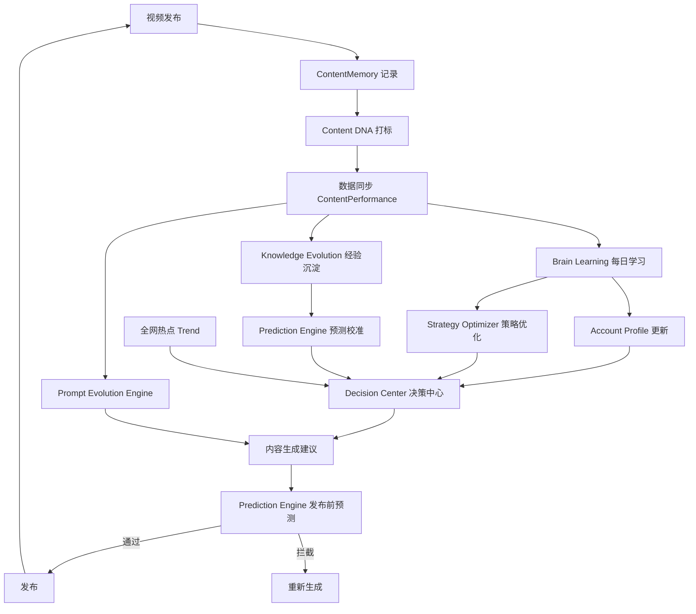

# AI Memory — 个人账号内容大脑 开发文档

> 版本：V2.5（含 Prompt Evolution Engine）  
> 状态：设计稿  
> 最后更新：2026-07-09

---

## 一、设计目标

### 1.1 核心命题

为**每个账号**建立独立的 AI Memory，让 AI 从该账号的历史数据中持续学习，而非仅依赖通用热点。

### 1.2 设计原则

| 原则 | 说明 |
|------|------|
| 账号优先 | 内容生成时，**账号经验占 70%**，全网热点占 30% |
| 数据闭环 | 发布 → 记录 → 打标 → 学习 → 预测 → 优化，形成完整生命周期 |
| 可解释决策 | 每条建议、预测、策略调整均需附带理由与数据支撑 |
| 持续进化 | Prompt、策略、经验库随账号成长自动迭代 |

### 1.3 示例场景

账号 A 已发布 **356 条**视频，AI 总结：

| 内容类型 | 表现排序 |
|----------|----------|
| 口诀型 | 最好 |
| 黄帝内经 | 其次 |
| 情绪养生 | 最差 |

**生成内容时的权重分配：**

```
账号历史经验  70%  ← 优先
全网热点趋势  30%  ← 辅助
```

> 与市面常见做法相反：多数工具以热点为主、账号数据为辅。本系统以账号数据为核心决策依据。

---

## 二、整体架构

### 2.1 架构图

```
                    全网爆款数据库
                          │
                          ▼
                   趋势分析（Trend）
                          │
────────────────────────────────────────────
                          │
                    个人账号数据库
                          │
         历史视频 + 后台数据 + 发布时间
                          │
                          ▼
              Personal Content Brain
                          │
           AI 经验总结 / AI 学习 / AI 预测
                          │
                          ▼
                 今日最佳创作建议
```

### 2.2 双数据源模型

| 数据源 | 职责 | 更新频率 |
|--------|------|----------|
| 全网爆款数据库 | 行业趋势、热点话题、爆款模板 | 实时 / 日更 |
| 个人账号数据库 | 单账号历史内容与表现数据 | 发布后实时 + 定时同步 |

### 2.3 核心模块

| 模块 | 职责 |
|------|------|
| Content Memory | 视频内容全生命周期记录 |
| Content DNA | AI 自动标签与结构化分析 |
| Brain Learning | 定时学习、生成账号报告 |
| Prediction Engine | 发布前效果预测与拦截 |
| Strategy Optimizer | 失败归因与策略调整建议 |
| Account Profile | 账号画像自动生成 |
| Knowledge Evolution | 爆款 / 失败经验库 |
| Decision Center | 综合决策入口（最终目标） |
| Prompt Evolution Engine | Prompt 版本管理与自动进化（V2.5） |

---

## 三、AI 记忆内容（Video Memory）

### 3.1 记录时机

每条视频**发布时自动记录**，发布后**持续更新**表现数据，最终形成一条视频的完整生命周期。

### 3.2 发布时记录字段

| 字段 | 说明 |
|------|------|
| VideoId | 视频唯一标识 |
| Platform | 发布平台（视频号 / 抖音 / 小红书等） |
| PublishTime | 发布时间 |
| Title | 标题 |
| Script | 完整脚本 |
| Template | 内容模板（口诀 / 动作 / 情绪等） |
| Hook | 开头钩子 |
| CTA | 行动号召 |
| Prompt | 生成时使用的 Prompt 版本 |
| SceneStyle | 画面风格 |
| Duration | 时长（秒） |
| Keyword | 关键词 |
| Category | 栏目 |
| KnowledgeSource | 知识来源（如黄帝内经） |
| Season | 节气 / 季节 |
| Festival | 节日 |
| Weather | 天气（可选） |

### 3.3 发布后持续更新字段

| 字段 | 说明 |
|------|------|
| View | 播放量 |
| CTR | 点击率 |
| 3sRate | 3 秒留存率 |
| FinishRate | 完播率 |
| AverageWatch | 平均观看时长 |
| Like | 点赞 |
| Comment | 评论 |
| Collect | 收藏 |
| Share | 分享 |
| Forward | 转发 |
| RecommendRate | 推荐率 |
| EngagementRate | 互动率 |
| FansIncrease | 涨粉数 |
| ReachLevel | 流量层级 |

### 3.4 生命周期状态

```
创建记录 → 发布 → 数据同步（T+1h / T+24h / T+7d）→ 打标完成 → 纳入学习样本 → 写入经验库
```

---

## 四、AI 自动标签（Content DNA）

### 4.1 功能说明

AI 对每条视频进行结构化分析，自动生成内容 DNA 标签，全部存入数据库，供学习与预测使用。

### 4.2 标签维度

| 维度 | 示例值 |
|------|--------|
| 标题类型 | 口诀型 / 数字型 / 疑问型 |
| Hook 类型 | 老祖宗 / 很多人 / 60 岁以后 |
| 内容模板 | 口诀 / 动作 / 情绪 |
| 知识类型 | 黄帝内经 / 养阳 / 养心 |
| 情绪类型 | 获得感 / 焦虑感 / 共鸣感 |
| 画面类型 | 水墨 / 数字人 / 实拍 |
| 镜头节奏 | 快切 / 慢节奏 / 混合 |
| CTA 类型 | 收藏 / 关注 / 评论 |

### 4.3 标注示例

**输入标题：** 老祖宗留下来的养阳口诀

**AI 输出：**

```json
{
  "hook_type": "老祖宗",
  "template": "口诀",
  "knowledge": "黄帝内经",
  "emotion": "获得感",
  "scene": "古风",
  "cta": "收藏"
}
```

---

## 五、AI 自动学习（Brain Learning）

### 5.1 触发机制

每天凌晨自动执行，分析最近 **30 / 60 / 100** 条视频（可配置窗口）。

### 5.2 学习维度

| 维度 | 输出内容 |
|------|----------|
| 内容模板 | 各模板平均播放量排名 |
| 标题模式 | 高频标题前缀及对应播放表现 |
| 画面风格 | 各画面类型平均播放对比 |
| 发布时间 | 各时段发布效果排名 |
| Hook / CTA | 高转化组合识别 |

### 5.3 输出示例

**最近 30 条 — 模板表现：**

| 模板 | 平均播放 |
|------|----------|
| 口诀 | 420 |
| 动作 | 390 |
| 情绪 | 110 |

**标题前缀表现：**

| 标题模式 | 平均播放 |
|----------|----------|
| 老祖宗…… | 460 |
| 很多人…… | 280 |
| 60 岁以后…… | 500 |

**画面风格：**

| 画面 | 平均播放 |
|------|----------|
| 水墨 | 450 |
| 数字人 | 310 |

**发布时间：**

| 时段 | 效果 |
|------|------|
| 20:00 | 最好 |
| 17:00 | 一般 |
| 22:00 | 最差 |

### 5.4 产出物

每次学习生成一份 **账号学习报告**，写入 `BrainLearning` 表，包含：

- Summary（总结）
- Strength（优势）
- Weakness（短板）
- Trend（趋势）
- Suggestion（建议）
- Optimization（优化方向）

---

## 六、AI 预测系统（Prediction Engine）

### 6.1 功能定位

在**生成文案之后、发布之前**，AI 预测该内容的表现。这是降低低质量内容发布的关键环节。

### 6.2 预测流程

```
文案生成完成
      │
      ▼
AI 预测引擎（综合账号历史 + DNA 匹配 + 热点契合度）
      │
      ├── 预测播放 ≥ 阈值 → 建议发布
      │
      └── 预测播放 < 阈值 → 建议不发布，重新生成
```

### 6.3 预测输出结构

| 字段 | 说明 |
|------|------|
| PredictView | 预计播放量 |
| PredictFinishRate | 预计完播率 |
| PredictLevel | 预测等级（★ 1–5） |
| Confidence | 置信度 |
| Reason | 预测理由（结构化列表） |

### 6.4 预测示例

**输入：** 标题《黄帝内经：夏天养心》

**AI 输出：**

```
预计播放：420
预测等级：★★★★☆
理由：
  ✓ 符合账号口诀模板偏好
  ✓ 契合夏季养生热点
  ✓ 黄帝内经知识来源表现稳定
  ✓ 收藏价值高
```

**低分拦截示例：**

```
预计播放：120
预测等级：★★☆☆☆
建议：不建议发布，请重新生成
原因：情绪模板近期表现下滑，Hook 类型与账号优势不匹配
```

### 6.5 预测校准

发布后对比实际数据，写入 `PredictionHistory`，用于持续校准预测模型精度。

---

## 七、AI 策略优化（Strategy Optimizer）

### 7.1 触发机制

每天自动总结近期失败原因，输出可执行的策略调整建议。

### 7.2 失败归因维度

| 归因类型 | 说明 |
|----------|------|
| 前三秒弱 | 开头留存率低 |
| 画面重复 | 近期画面风格同质化 |
| Hook 太平 | 钩子缺乏冲击力 |
| 知识获得感不足 | 内容价值感知低 |
| 时长不匹配 | 超出账号最佳时长区间 |
| 发布时间不佳 | 时段与账号历史数据背离 |

### 7.3 输出示例

**近期失败原因：**

1. 前三秒弱
2. 画面重复
3. Hook 太平
4. 知识获得感不足

**策略调整建议：**

| 方向 | 动作 |
|------|------|
| 增加 | 口诀模板、动作演示、数字化标题 |
| 减少 | 情绪类内容 |
| 优化 | Hook 冲击力、画面差异化 |

---

## 八、账号画像（Account Profile）

### 8.1 功能说明

AI 根据历史数据自动生成账号画像，在首页直接展示，作为运营决策的快速参考。

### 8.2 画像字段

| 字段 | 示例 |
|------|------|
| Platform | 视频号 |
| AccountType | 知识型账号 |
| BestCategory | 口诀 |
| BestScene | 水墨 |
| BestDuration | 28–35 秒 |
| BestPublishTime | 19:30 |
| BestCTA | 收藏 |
| BestHook | 老祖宗 |
| BestKnowledgeSource | 黄帝内经 |

### 8.3 更新机制

- 每次 Brain Learning 后刷新画像
- 新样本量达到阈值时触发重算
- 支持手动锁定某些字段（防止短期波动覆盖长期结论）

---

## 九、经验库（Knowledge Evolution）

### 9.1 功能说明

对每条爆款和失败视频进行深度归因分析，沉淀为可检索的经验库。AI 越用越像该账号的专属运营总监。

### 9.2 爆款分析结构

**示例：410 播放爆款**

| 维度 | 评分 | 说明 |
|------|------|------|
| 标题（口诀型） | ★★★★★ | 符合账号最佳模板 |
| Hook（老祖宗） | ★★★★★ | 账号历史最高转化 Hook |
| 知识（养阳） | ★★★★★ | 高收藏价值话题 |
| 收藏价值 | ★★★★★ | CTA 与内容匹配 |
| 互动 | ★★★☆☆ | 正常水平 |

### 9.3 失败视频分析

同样结构，标注各维度短板，与爆款形成对比样本，供预测引擎和学习模块引用。

### 9.4 经验库用途

- 预测引擎的特征匹配
- 内容生成时的 Few-shot 参考
- 策略优化器的归因依据
- 决策中心的推理素材

---

## 十、AI 决策中心（Decision Center）

### 10.1 最终目标

用户点击「今天发什么？」时，AI 不是随机推荐，而是基于多维度数据综合决策。

### 10.2 决策输入

| 输入源 | 权重参考 |
|--------|----------|
| 账号历史经验 | 70% |
| 全网热点趋势 | 30% |
| 昨日 / 近期数据 | 实时修正 |
| 节气 / 节日 | 时效加成 |
| 最佳发布时间 | 排期建议 |
| 平台特性 | 格式适配 |
| 过去 100 条经验库 | 深度匹配 |

### 10.3 决策输出示例

```
推荐第一名：
  标题：《黄帝内经：夏季养心》
  预测等级：★★★★☆
  预计播放：480
  建议发布时间：19:30

  推荐理由：
    · 夏季养生话题全网上涨
    · 账号口诀类平均播放最高
    · 近期动作类内容表现下降
    · 黄帝内经知识源稳定高产
    · 符合最佳时长与画面风格
```

---

## 十一、数据库设计

### 11.1 ER 关系概览

```
Account
   │
   ├── ContentMemory (1:N)
   │        │
   │        └── ContentPerformance (1:1, 持续更新)
   │
   ├── BrainLearning (1:N, 每日)
   ├── PredictionHistory (1:N)
   ├── KnowledgeEvolution (1:N)
   └── PromptVersion (1:N)
```

### 11.2 ContentMemory — 视频内容记忆

| 字段 | 类型 | 说明 |
|------|------|------|
| Id | PK | 主键 |
| AccountId | FK | 所属账号 |
| Platform | string | 平台 |
| VideoId | string | 平台视频 ID |
| Title | string | 标题 |
| Script | text | 脚本 |
| Hook | string | 钩子 |
| Template | string | 内容模板 |
| KnowledgeSource | string | 知识来源 |
| Prompt | string | 使用的 Prompt 版本号 |
| SceneStyle | string | 画面风格 |
| Duration | int | 时长（秒） |
| CTA | string | 行动号召 |
| PublishTime | datetime | 发布时间 |
| Season | string | 节气 |
| Festival | string | 节日 |
| Weather | string | 天气 |
| Keyword | string | 关键词 |
| Category | string | 栏目 |
| DnaTags | json | Content DNA 标签（JSON） |
| CreatedAt | datetime | 创建时间 |
| UpdatedAt | datetime | 更新时间 |

### 11.3 ContentPerformance — 视频表现数据

| 字段 | 类型 | 说明 |
|------|------|------|
| Id | PK | 主键 |
| VideoId | FK | 关联 ContentMemory |
| View | int | 播放量 |
| CTR | float | 点击率 |
| 3sRate | float | 3 秒留存率 |
| FinishRate | float | 完播率 |
| AverageWatch | float | 平均观看时长 |
| Like | int | 点赞 |
| Comment | int | 评论 |
| Share | int | 分享 |
| Collect | int | 收藏 |
| Forward | int | 转发 |
| FansIncrease | int | 涨粉 |
| ReachLevel | string | 流量层级 |
| RecommendRate | float | 推荐率 |
| EngagementRate | float | 互动率 |
| SyncedAt | datetime | 最后同步时间 |

### 11.4 BrainLearning — 学习报告

| 字段 | 类型 | 说明 |
|------|------|------|
| Id | PK | 主键 |
| AccountId | FK | 所属账号 |
| Date | date | 学习日期 |
| SampleSize | int | 样本量（30/60/100） |
| Summary | text | 总结 |
| Suggestion | text | 建议 |
| Trend | text | 趋势 |
| Weakness | text | 短板 |
| Strength | text | 优势 |
| Optimization | text | 优化方向 |
| PromptVersion | string | 关联 Prompt 版本 |

### 11.5 PredictionHistory — 预测历史

| 字段 | 类型 | 说明 |
|------|------|------|
| Id | PK | 主键 |
| AccountId | FK | 所属账号 |
| VideoId | FK | 关联视频（发布后回填） |
| PredictView | int | 预测播放量 |
| ActualView | int | 实际播放量 |
| PredictFinishRate | float | 预测完播率 |
| ActualFinishRate | float | 实际完播率 |
| Confidence | float | 置信度 |
| ErrorRate | float | 误差率 |
| PredictLevel | int | 预测星级 |
| Reason | text | 预测理由 |
| CreatedAt | datetime | 预测时间 |

### 11.6 PromptVersion — Prompt 版本（V2.5）

| 字段 | 类型 | 说明 |
|------|------|------|
| Id | PK | 主键 |
| AccountId | FK | 所属账号 |
| Version | string | 版本号（V1, V2, …） |
| PromptContent | text | Prompt 全文 |
| ChangeLog | text | 相对上一版的变更说明 |
| VideoCount | int | 使用该版本生成的视频数 |
| AvgView | float | 平均播放量 |
| AvgFinishRate | float | 平均完播率 |
| RecommendScore | int | 推荐指数（1–5 星） |
| IsActive | bool | 是否为当前活跃版本 |
| CreatedAt | datetime | 创建时间 |

---

## 十二、Prompt Evolution Engine（V2.5 新增）

### 12.1 设计动机

市面几乎所有 AI 工具采用 **固定 Prompt → 固定输出**。本系统让 Prompt 随账号成长**自动进化**，形成技术壁垒。

### 12.2 进化机制

```
Prompt V1 → 生成 20 条 → 平均播放 320
      │
      ▼ 调整 Hook 规则
Prompt V2 → 生成 30 条 → 平均播放 450
      │
      ▼ 增加收藏价值 + 数字化标题
Prompt V3 → 生成 40 条 → 平均播放 610
      │
      ▼ 持续迭代 …
Prompt V12 → 生成 186 条 → 平均播放 835，完播率 31.2%
```

### 12.3 版本评估指标

| 指标 | 说明 |
|------|------|
| VideoCount | 该版本生成的视频总数 |
| AvgView | 平均播放量 |
| AvgFinishRate | 平均完播率 |
| RecommendScore | 综合推荐指数 |
| ChangeLog | 相对上一版的具体调整 |

### 12.4 进化触发条件

- 新 Prompt 版本样本量达到阈值（默认 20 条）
- 当前版本平均播放连续 N 期低于账号均值
- Brain Learning 报告建议调整生成策略
- 策略优化器识别到系统性短板

### 12.5 版本选择策略

内容生成时，默认使用 `IsActive = true` 的最高 RecommendScore 版本；预测引擎和决策中心引用版本表现数据辅助判断。

---

## 十三、模块依赖与数据流

### 13.1 完整数据流



### 13.2 模块调用关系

| 调用方 | 被调用方 | 场景 |
|--------|----------|------|
| 内容生成 | PromptVersion + AccountProfile + KnowledgeEvolution | 生成文案 |
| 内容生成 | PredictionEngine | 发布前预测 |
| BrainLearning | ContentMemory + ContentPerformance + ContentDNA | 每日学习 |
| DecisionCenter | 全部模块 | 综合决策 |
| PromptEvolution | BrainLearning + ContentPerformance | Prompt 迭代 |

---

## 十四、实施路线图（建议）

| 阶段 | 模块 | 优先级 | 说明 |
|------|------|--------|------|
| P0 | ContentMemory + ContentPerformance | 必须 | 数据基础，先跑通记录与同步 |
| P0 | Content DNA 打标 | 必须 | 结构化标签是学习前提 |
| P1 | Brain Learning + Account Profile | 高 | 每日学习 + 首页画像 |
| P1 | Prediction Engine | 高 | 发布前拦截低质量内容 |
| P2 | Knowledge Evolution | 中 | 爆款 / 失败经验库 |
| P2 | Strategy Optimizer | 中 | 失败归因与策略调整 |
| P3 | Decision Center | 中 | 综合决策入口 |
| P3 | Prompt Evolution Engine | 高 | 技术壁垒，可与 P2 并行 |

---

## 十五、开放问题（待确认）

1. **多平台数据同步**：各平台 API 接入方式与同步频率
2. **预测阈值**：拦截线的默认值及是否支持账号级自定义
3. **学习窗口**：30 / 60 / 100 条的默认策略与切换规则
4. **Prompt 进化边界**：自动进化 vs 人工审核的权限划分
5. **账号隔离**：多账号场景下的数据隔离与跨账号对比分析需求

---

## 附录 A：术语表

| 术语 | 定义 |
|------|------|
| AI Memory | 单账号的历史内容 + 表现 + 学习结论的集合 |
| Content DNA | 视频内容的结构化标签体系 |
| Personal Content Brain | 个人账号内容大脑，整合学习、预测、决策的 AI 中枢 |
| Prompt Evolution | Prompt 随数据反馈自动迭代升级的机制 |
| Knowledge Evolution | 爆款与失败经验的沉淀与复用体系 |
